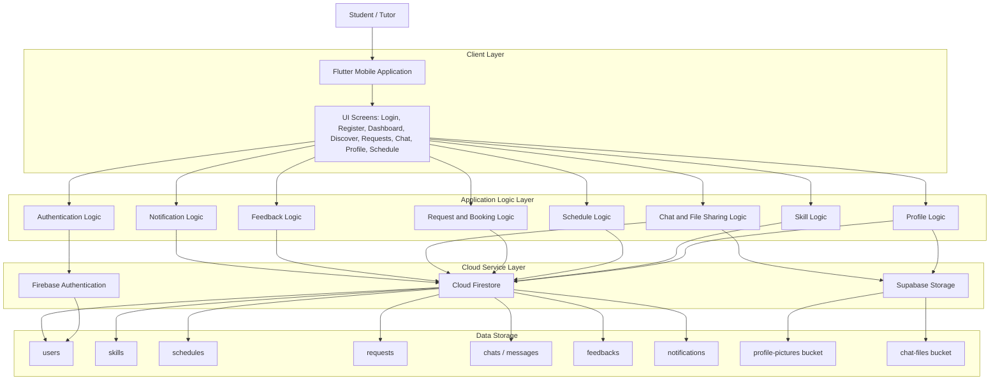
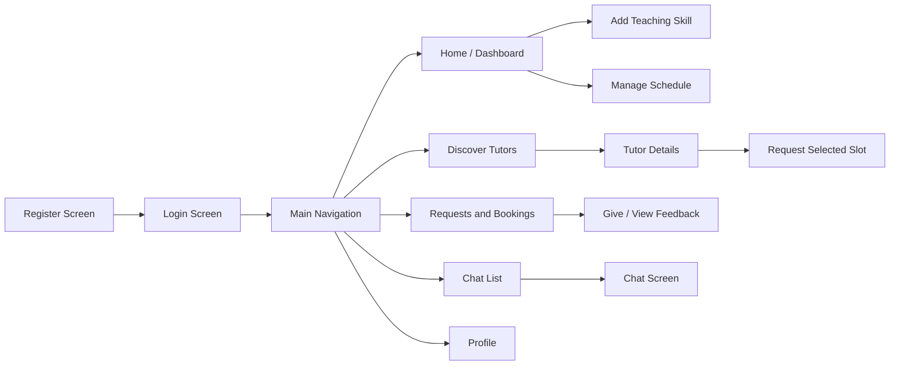
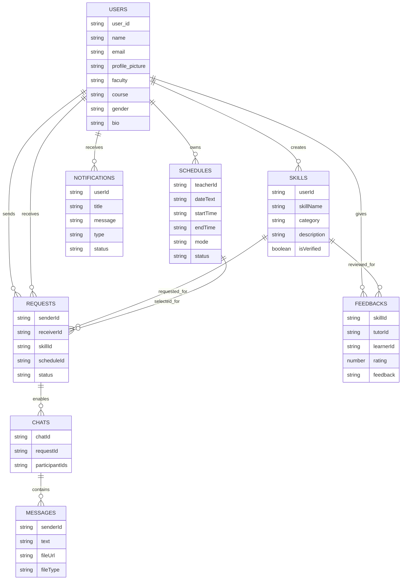

# STUDENT SKILL EXCHANGE

## Final Year Project Report Draft

Programme: BITS - Software Development  
Project Title: Student Skill Exchange  
Platform: Flutter Mobile Application  
Backend Services: Firebase Authentication, Cloud Firestore, Supabase Storage  
Prepared by: [Student Name]  
Supervisor: [Supervisor Name]  
Faculty: Faculty of Information and Communications Technology  
University: Universiti Teknikal Malaysia Melaka  
Year: 2026

---

# ABSTRACT

Student Skill Exchange is a mobile application developed to support peer-to-peer learning among university students. The system allows students to register, complete their profile, offer skills that they can teach, discover tutors, request available learning slots, communicate through chat, and provide rating and feedback after a learning session. The project addresses the problem of informal and scattered skill sharing among students, where learners often have difficulty finding suitable peers, checking availability, managing booking status, and maintaining communication records. The proposed solution is implemented as a Flutter mobile application integrated with Firebase Authentication, Cloud Firestore, and Supabase Storage. Firebase Authentication manages user account access, Cloud Firestore stores structured application data such as users, skills, schedules, requests, chats, feedback, and notifications, while Supabase Storage manages uploaded profile pictures and chat files. The system was developed using a software development approach that includes requirement analysis, design, implementation, and testing. The expected output is a working mobile application that improves the accessibility, organization, and reliability of student-based skill exchange within the university environment.

---

# TABLE OF CONTENTS

CHAPTER 1. INTRODUCTION  
1.1 Introduction  
1.2 Problem Statements  
1.3 Objectives  
1.4 Scope  
1.5 Project Significance  
1.6 Expected Output  
1.7 Conclusion  

CHAPTER 2. LITERATURE REVIEW AND PROJECT METHODOLOGY  
2.1 Introduction  
2.2 Domain  
2.3 Existing System  
2.4 Technique  
2.5 Project Methodology  
2.6 Project Requirements  
2.7 Project Schedule and Milestones  
2.8 Conclusion  

CHAPTER 3. ANALYSIS  
3.1 Introduction  
3.2 Problem Analysis  
3.3 Requirement Analysis  
3.4 Data Requirement  
3.5 Functional Requirement  
3.6 Non-Functional Requirement  
3.7 Other Requirement  
3.8 Conclusion  

CHAPTER 4. DESIGN  
4.1 Introduction  
4.2 High-Level Design  
4.3 System Architecture  
4.4 User Interface Design  
4.5 Database Design  
4.6 Detailed Design  
4.7 Conclusion  

CHAPTER 5. IMPLEMENTATION  
5.1 Introduction  
5.2 Software Development Environment Setup  
5.3 Software Configuration Management  
5.4 Version Control Procedure  
5.5 Implementation Status  
5.6 Conclusion  

CHAPTER 6. TESTING  
6.1 Introduction  
6.2 Test Plan  
6.3 Test Strategy  
6.4 Classes of Tests  
6.5 Test Design  
6.6 Test Results and Analysis  
6.7 Conclusion  

CHAPTER 7. CONCLUSION  
7.1 Observation on Weaknesses and Strengths  
7.2 Propositions for Improvement  
7.3 Project Contribution  
7.4 Conclusion  

REFERENCES  
BIBLIOGRAPHY  
APPENDICES

---

# CHAPTER 1. INTRODUCTION

## 1.1 Introduction

Student Skill Exchange is a mobile-based software development project designed to help university students share and learn skills from one another. In a university environment, students often possess useful technical and non-technical skills such as programming, mobile development, database management, graphic design, public speaking, mathematics, language, music, and other academic or creative abilities. However, these skills are usually shared informally through personal contacts, group chats, or social media posts. This makes it difficult for students to discover suitable tutors, confirm their availability, arrange sessions, communicate, and provide feedback in an organized way.

The Student Skill Exchange application provides a centralized platform where students can act as both learners and tutors. A user can create an account, complete a personal profile, list teaching skills, manage available time slots, search for tutors, request a learning session, chat with another user, and give feedback after the session is completed. The project is developed using Flutter as the frontend framework and cloud services for backend functionality. Firebase Authentication is used for user authentication, Cloud Firestore is used for structured data storage, and Supabase Storage is used for file and image storage.

This project belongs to the BITS Software Development category because it focuses on designing, developing, and testing an application system that solves a real user problem. The project includes software analysis, system design, database design, implementation, and functional testing.

## 1.2 Problem Statements

The main problems identified in the current student skill-sharing process are as follows:

1. Students do not have a centralized platform to discover peers who can teach specific skills. Skill sharing often depends on personal networks, class groups, or informal recommendations.

2. Learners may not know whether a potential tutor is available at a suitable time. Without a scheduling feature, both parties need to manually negotiate session time through messages.

3. There is no structured request and booking process. Students may forget session details, misunderstand booking status, or lose track of pending, accepted, rejected, cancelled, and completed requests.

4. Communication between learners and tutors may be scattered across different messaging platforms. This makes it difficult to keep learning-related messages, images, and files in one place.

5. There is limited trust and feedback information. Learners may not know the quality of a tutor before requesting a session, and tutors may not receive structured feedback for improvement.

## 1.3 Objectives

The objectives of this project are:

1. To design and develop a mobile application for student skill exchange.
2. To develop a system that allows students to list, manage, and share their skills.
3. To implement a skill matching and search mechanism to connect students with similar learning interests.
4. To develop a request management system that allows students to send and manage learning requests.
5. To evaluate the effectiveness of the system in supporting collaborative learning among students.

## 1.4 Scope

The scope of the project includes:

- User management: account registration, login, password reset, logout, and profile management.
- Tutor discovery and skill matching: browsing, searching, filtering, and viewing tutor details based on skill and learner interest.
- Skill management: listing, managing, deleting, and sharing teaching skills.
- Schedule management: adding and deleting available learning slots.
- Request management: sending, viewing, accepting, rejecting, cancelling, and completing learning requests.
- Chat management: sending messages, editing messages, deleting messages, uploading images, uploading files, and opening shared file URLs.
- Feedback management: giving ratings, writing feedback, viewing feedback, and replying to feedback.
- Notification management: creating and displaying notifications for request, chat, feedback, and schedule-related actions.

The project focuses on a mobile application environment. It does not include payment processing, automated video conferencing, administrator dashboards, or artificial intelligence-based tutor recommendation.

## 1.5 Project Significance

The project benefits students by making peer learning more accessible and organized. Learners can find suitable tutors more easily, while tutors can share their knowledge and manage their teaching availability. The system also supports the university environment by encouraging collaborative learning, academic support, and student-to-student engagement.

The application provides value in the following ways:

- Improves visibility of student skills within the university.
- Reduces manual coordination between learners and tutors.
- Keeps booking status, schedule information, chat messages, and feedback in one application.
- Encourages students to build confidence by teaching others.
- Supports a community-based learning culture.

## 1.6 Expected Output

The expected output of this project is a working Flutter mobile application named Student Skill Exchange. The system should allow users to create an account, complete their profile, list and manage skills, search for matching tutors, send and manage learning requests, communicate through chat, receive notifications, and submit feedback. The completed system should also provide evidence that the application supports collaborative learning through functional testing and user evaluation.

The expected technical output includes:

- A Flutter application with multiple functional screens.
- Firebase Authentication integration.
- Cloud Firestore collections for users, skills, schedules, requests, chats, messages, feedback, and notifications.
- Supabase Storage buckets for profile pictures and chat files.
- Use case diagram and system architecture diagram.
- Test cases, test result documentation, and effectiveness evaluation findings.

## 1.7 Conclusion

This chapter introduced the Student Skill Exchange project, the problems that motivate its development, the objectives, project scope, significance, and expected output. The next chapter discusses the literature review, related systems, selected techniques, methodology, and project requirements.

---

# CHAPTER 2. LITERATURE REVIEW AND PROJECT METHODOLOGY

## 2.1 Introduction

This chapter discusses the domain of peer-to-peer learning and mobile learning support systems. It also describes existing approaches, selected development techniques, project methodology, software and hardware requirements, and project schedule. The purpose of this chapter is to justify the approach used in developing the Student Skill Exchange system.

## 2.2 Domain

The project domain is peer-to-peer learning and skill exchange in a university environment. Peer-to-peer learning allows students to learn from other students who already have knowledge or experience in a particular topic. In higher education, peer learning can support formal classroom learning by allowing students to receive help in a more flexible and informal way.

The Student Skill Exchange system focuses on matching students who want to learn a skill with students who are willing to teach. The domain involves several important activities:

- User profile creation and trust building.
- Skill publication and discovery.
- Schedule availability management.
- Learning request management.
- Communication between learner and tutor.
- Feedback and rating after learning sessions.

## 2.3 Existing System

In many student communities, skill sharing happens through informal channels such as WhatsApp groups, Telegram groups, classroom announcements, personal recommendations, or social media posts. Although these methods are easy to use, they are not designed specifically for structured skill exchange.

The limitations of informal existing systems include:

- Skill posts can be lost in group chat history.
- Students cannot easily filter tutors by faculty, course, gender, or skill.
- There is no standard method to show tutor availability.
- Booking status is not clearly tracked.
- Feedback is not stored in a structured way.
- Chat files and session details may be scattered across several platforms.

Some commercial learning platforms provide online tutoring features, but they may not be suitable for a university-specific peer-learning context. They often target professional tutors, paid courses, or public learning communities rather than a closed student environment. Therefore, this project proposes a focused mobile system for student-to-student skill exchange.

## 2.4 Technique

The main techniques used in the project are:

- Mobile application development using Flutter and Dart.
- Cloud-based authentication using Firebase Authentication.
- NoSQL cloud database storage using Cloud Firestore.
- Cloud file storage using Supabase Storage.
- Real-time data display using Firestore streams.
- Modular screen-based application structure.
- Form validation and confirmation dialogs for important actions.
- Notification records stored in Firestore.

Flutter was selected because it supports cross-platform mobile application development using one codebase. Firebase Authentication and Firestore were selected because they provide managed backend services suitable for rapid software development. Supabase Storage was selected to store uploaded images and files used by profile and chat features.

## 2.5 Project Methodology

The selected methodology for this project is the Software Development Life Cycle (SDLC). SDLC is suitable because the project requires clear stages from requirement identification until testing. The stages are:

1. Requirement analysis: Identify the problems, users, features, data, and constraints of the system.
2. System design: Prepare use case diagram, system architecture, navigation flow, interface design, and database design.
3. Implementation: Develop the Flutter screens, Firebase integration, Firestore operations, Supabase file uploads, and application logic.
4. Testing: Test each module using functional testing, validation testing, and user flow testing.
5. Evaluation and improvement: Review system weaknesses, strengths, and possible future enhancements.

## 2.6 Project Requirements

### 2.6.1 Software Requirements

The software requirements are:

| Software | Purpose |
|---|---|
| Flutter SDK | Mobile application development |
| Dart SDK | Programming language runtime |
| Firebase Authentication | User authentication |
| Cloud Firestore | Cloud database |
| Supabase Storage | File and image storage |
| Visual Studio Code or Android Studio | Development environment |
| Android Emulator or physical Android device | Application testing |
| Git | Source code version control |
| Draw.io / diagrams.net | Diagram preparation |

### 2.6.2 Hardware Requirements

The hardware requirements are:

| Hardware | Purpose |
|---|---|
| Laptop or desktop computer | Development and testing |
| Android smartphone or emulator | Running the mobile application |
| Internet connection | Firebase and Supabase access |
| Storage space | Project files and application build files |

### 2.6.3 Other Requirements

Other requirements include:

- Firebase project configuration.
- Supabase project configuration.
- Internet access during application runtime.
- Test user accounts for learner and tutor workflows.
- Sample data for skills, schedules, requests, chat messages, and feedback.

## 2.7 Project Schedule and Milestones

| Phase | Activities | Expected Output |
|---|---|---|
| Planning | Identify problem, objectives, scope, and project feasibility | Project proposal |
| Analysis | Study user requirements and system functions | Requirement specification |
| Design | Prepare system architecture, use case, navigation, UI, and database design | Design documentation |
| Implementation | Develop authentication, profile, skills, schedule, request, chat, feedback, and notification modules | Working application prototype |
| Testing | Conduct module testing and user flow testing | Test result documentation |
| Finalization | Improve UI, fix issues, prepare report and appendix | Final report and system |

## 2.8 Conclusion

This chapter explained the project domain, existing system limitations, selected technical approach, SDLC methodology, project requirements, and schedule. The next chapter presents the analysis of the system, including problem analysis, data requirements, functional requirements, and non-functional requirements.

---

# CHAPTER 3. ANALYSIS

## 3.1 Introduction

This chapter presents the analysis phase of the Student Skill Exchange project. The analysis focuses on understanding the current problem scenario, identifying the data required by the system, defining functional requirements, and defining non-functional requirements.

## 3.2 Problem Analysis

The current peer-learning process among students is usually informal. A learner may need help with a subject or skill, but the learner may not know which student can teach it. A tutor may be willing to teach, but other students may not know the tutor's availability or skill area. When arrangements are made manually, several problems can occur:

- The learner may ask multiple people before finding a suitable tutor.
- The tutor may need to repeatedly explain available time slots.
- Booking decisions may not be recorded clearly.
- Session status may be unclear after a request is sent.
- Chat history and shared files may not be connected to the learning request.
- Feedback may not be visible to future learners.

The proposed system solves these problems by introducing structured modules for profile, skill, schedule, request, chat, notification, and feedback.

## 3.3 Requirement Analysis

The system has two main user roles:

- Learner: A student who searches for skills and requests learning sessions.
- Tutor: A student who publishes skills and manages availability.

In this project, the same user can act as both learner and tutor. A student can learn from others while also teaching skills they already know.

## 3.4 Data Requirement

The main data required by the system is shown below:

| Data Entity | Description |
|---|---|
| User | Stores account profile details such as name, email, faculty, course, gender, bio, and profile picture |
| Skill | Stores teaching skill details such as skill name, category, description, tutor ID, tutor name, and verification status |
| Schedule | Stores tutor availability such as date, day, start time, end time, mode, location or link, and status |
| Request | Stores learning booking details such as learner, tutor, skill, selected schedule, and request status |
| Chat | Stores chat metadata between learner and tutor |
| Message | Stores chat message content, sender, file URL, file type, and timestamp |
| Feedback | Stores rating, comment, reply, skill ID, tutor ID, and learner ID |
| Notification | Stores notification title, message, type, user ID, related request, skill, schedule, and read status |

## 3.5 Functional Requirement

The functional requirements are:

| ID | Requirement |
|---|---|
| FR01 | The system shall allow a user to register an account. |
| FR02 | The system shall allow a user to login and logout. |
| FR03 | The system shall allow a user to reset password using email. |
| FR04 | The system shall allow a user to update profile details. |
| FR05 | The system shall allow a user to upload a profile picture. |
| FR06 | The system shall allow a tutor to add a teaching skill. |
| FR07 | The system shall allow a tutor to delete an owned skill. |
| FR08 | The system shall allow a tutor to add available schedule slots. |
| FR09 | The system shall allow a tutor to delete schedule slots. |
| FR10 | The system shall allow a learner to browse tutors. |
| FR11 | The system shall allow a learner to search and filter tutors as a skill matching mechanism. |
| FR12 | The system shall allow a learner to view tutor details and available schedules. |
| FR13 | The system shall allow a learner to send a request for a selected schedule. |
| FR14 | The system shall allow a tutor to accept or reject a request. |
| FR15 | The system shall allow a learner to cancel a booking. |
| FR16 | The system shall allow users to mark a session as completed. |
| FR17 | The system shall allow users to chat after a valid request relationship. |
| FR18 | The system shall allow users to upload images and files in chat. |
| FR19 | The system shall allow a learner to give rating and feedback. |
| FR20 | The system shall allow a tutor to view and reply to feedback. |
| FR21 | The system shall create and display notifications. |
| FR22 | The system shall support evaluation of collaborative learning effectiveness through test results, feedback, and user flow completion. |

## 3.6 Non-Functional Requirement

The non-functional requirements are:

| ID | Requirement |
|---|---|
| NFR01 | The system should provide a clear and consistent mobile user interface. |
| NFR02 | The system should protect user access using Firebase Authentication. |
| NFR03 | The system should store data in a structured and retrievable manner. |
| NFR04 | The system should display real-time updates for chat, notifications, and request status where applicable. |
| NFR05 | The system should validate important input fields before saving data. |
| NFR06 | The system should prevent users from requesting a skill before completing required profile details. |
| NFR07 | The system should provide confirmation dialogs for important actions such as deleting, accepting, rejecting, and sending requests. |
| NFR08 | The system should support file upload for profile picture and chat attachment use cases. |

## 3.7 Other Requirement

Other requirements include:

- Users must have an internet connection to access Firebase and Supabase.
- Firebase and Supabase projects must be configured before deployment.
- The application should be tested on Android emulator or Android device.
- Firestore security rules and Supabase storage policies should be configured before production use.

## 3.8 Conclusion

This chapter identified the system problem, users, data requirements, functional requirements, and non-functional requirements. The next chapter describes the design of the system, including high-level design, system architecture, user interface design, database design, and detailed design.

---

# CHAPTER 4. DESIGN

## 4.1 Introduction

This chapter explains the design of the Student Skill Exchange system. The design includes the high-level structure, system architecture, user interface design, database design, and detailed module design.

## 4.2 High-Level Design

The system is designed as a cloud-connected mobile application. The Flutter mobile app acts as the client layer. Firebase Authentication handles user identity. Cloud Firestore stores application records. Supabase Storage stores uploaded media and files. The application communicates directly with cloud services using SDKs.

The main modules are:

- Authentication module.
- Profile module.
- Skill module.
- Schedule module.
- Discover module.
- Request and booking module.
- Chat module.
- Feedback module.
- Notification module.

## 4.3 System Architecture

The system architecture is based on a client-cloud model. The mobile app contains the user interface and application logic, while backend services are provided by Firebase and Supabase.

## 4.4 User Interface Design

The user interface is designed using Flutter Material components. The main navigation screen uses five primary tabs:

- Home: Displays dashboard information, user summary, and shortcut actions.
- Discover: Displays tutor list, search field, and filter function.
- Requests: Displays request and booking records.
- Chat: Displays conversation list and chat messages.
- Profile: Displays and updates user profile information.

### 4.4.1 Navigation Design

The navigation flow is:

### 4.4.2 Input Design

Examples of input fields include:

| Screen | Input |
|---|---|
| Login | Email, password |
| Register | Full name, email, password |
| Profile | Name, phone number, bio, gender, faculty, course |
| Add Skill | Skill name, category, description |
| Schedule | Date, time, mode, location or link |
| Discover | Search text, faculty filter, course filter, gender filter |
| Chat | Text message, image, file |
| Feedback | Rating, feedback comment |

Input validation is applied to required fields such as login email, password, skill name, description, profile completion fields, schedule details, and feedback rating.

### 4.4.3 Output Design

The system outputs include:

| Output | Description |
|---|---|
| Tutor list | Shows available tutors and skills |
| Tutor details | Shows tutor profile, skill information, schedule, and feedback |
| Request status | Shows pending, accepted, rejected, cancelled, and completed status |
| Chat messages | Shows text, image, and file messages |
| Notifications | Shows unread and clicked notifications |
| Feedback list | Shows rating, comment, and reply |
| Dashboard statistics | Shows summary of teaching and learning activity |

## 4.5 Database Design

The database is implemented using Cloud Firestore. Since Firestore is a NoSQL database, records are stored as documents inside collections.

### 4.5.1 Main Collections

| Collection | Purpose |
|---|---|
| users | Stores user profile information |
| skills | Stores tutor skill listings |
| schedules | Stores tutor availability slots |
| requests | Stores booking requests |
| chats | Stores chat metadata |
| chats/{chatId}/messages | Stores messages for each chat |
| feedbacks | Stores ratings, comments, and replies |
| notifications | Stores notification records |

### 4.5.2 Entity Relationship Overview

## 4.6 Detailed Design

### 4.6.1 Authentication Module

The authentication module allows users to register, login, reset password, and logout. Firebase Authentication is used to verify the user account. After registration, a user document is created in the users collection with default profile fields.

### 4.6.2 Profile Module

The profile module allows users to update personal details such as name, phone number, faculty, course, gender, year of study, bio, and profile picture. Profile picture uploads are handled by Supabase Storage, and the resulting public URL is stored in Firestore.

### 4.6.3 Skill Module

The skill module allows users to add teaching skills. A skill record stores tutor ID, tutor email, tutor name, profile picture, faculty, course, gender, skill name, category, description, verification status, and timestamps. The system checks that the user profile is completed before allowing skill creation.

### 4.6.4 Schedule Module

The schedule module allows tutors to create availability slots. Each schedule stores tutor ID, date, day, start time, end time, mode, location or link, and status. A schedule can be available, booked, completed, or another status depending on request actions.

### 4.6.5 Request Module

The request module allows learners to request a selected schedule from a tutor. The request stores sender information, receiver information, skill information, selected schedule information, request status, and timestamps. The system also updates the related schedule status when a request is created or cancelled.

### 4.6.6 Chat Module

The chat module allows users to exchange text messages, images, and files. Messages are stored inside a messages subcollection under a chat document. Uploaded images and files are stored in Supabase Storage and linked in Firestore.

### 4.6.7 Feedback Module

The feedback module allows learners to give a rating and comment after a session. Tutors can view feedback and reply to it. Feedback helps future learners understand tutor quality and supports improvement.

### 4.6.8 Notification Module

The notification module creates notification documents in Firestore. Notifications are used for request, chat, schedule, and feedback events. The application displays unread notification indicators in the navigation and notification screen.

## 4.7 Conclusion

This chapter described the system design, architecture, user interface, database structure, and detailed module design. The next chapter explains the implementation of the system.

---

# CHAPTER 5. IMPLEMENTATION

## 5.1 Introduction

This chapter explains the implementation of the Student Skill Exchange system. It includes the development environment, configuration management, version control procedure, and implementation status of each module.

## 5.2 Software Development Environment Setup

The system was implemented using Flutter and Dart. Firebase and Supabase were configured as cloud services. The application structure is organized mainly under the lib directory.

Key project files and folders include:

| Path | Purpose |
|---|---|
| lib/main.dart | Initializes Firebase, Supabase, theme, and application entry point |
| lib/screens | Contains application screens |
| lib/services | Contains service classes such as SupabaseService and NotificationService |
| lib/utils | Contains utility data such as faculty and course lists |
| pubspec.yaml | Defines dependencies and assets |
| assets/images | Stores application logo image |

The main dependencies used are:

| Dependency | Purpose |
|---|---|
| firebase_core | Firebase initialization |
| firebase_auth | User authentication |
| cloud_firestore | Firestore database access |
| supabase_flutter | Supabase client and storage access |
| image_picker | Camera and gallery image selection |
| file_picker | File selection for chat attachments |
| url_launcher | Opening uploaded file URLs |
| google_fonts | Application typography |

## 5.3 Software Configuration Management

Configuration management is handled through project folder organization and dependency management. The pubspec.yaml file controls Flutter dependencies and assets. Firebase configuration is stored in firebase_options.dart, while Supabase is initialized in main.dart.

The project separates screens and services to improve maintainability:

- Screens handle user interface and user interaction.
- Services handle reusable backend operations such as notification creation and Supabase file upload.
- Utility files store shared static data.

## 5.4 Version Control Procedure

The recommended version control procedure is:

1. Use Git to track source code changes.
2. Create meaningful commits after completing each module or bug fix.
3. Use feature branches for larger changes such as chat, schedule, or request modules.
4. Use tags for major versions such as prototype, beta, and final release.
5. Avoid committing generated build files and sensitive credentials.

Suggested release stages are:

| Stage | Description |
|---|---|
| Prototype | Basic authentication, profile, and skill features |
| Alpha | Core request and schedule workflow completed |
| Beta | Chat, feedback, and notification modules completed |
| Release Candidate | UI polish, validation, and testing completed |
| Final Release | Final submission version |

## 5.5 Implementation Status

| Module | Description | Status |
|---|---|---|
| Authentication | Register, login, reset password, logout | Completed |
| Main Navigation | Bottom navigation for Home, Discover, Requests, Chat, Profile | Completed |
| Profile | View and update profile, upload picture | Completed |
| Skill | Add and delete teaching skill | Completed |
| Discover / Matching | Search and filter tutors, match learners with relevant skills, view details | Completed |
| Schedule | Add and delete availability slots | Completed |
| Request Management | Send, accept, reject, cancel, and complete learning requests | Completed |
| Chat | Send text, image, file, edit and delete messages | Completed |
| Feedback | Give rating, view feedback, reply feedback | Completed |
| Notification | Create and display notifications | Completed |
| Evaluation | Functional test cases and effectiveness evaluation plan | In progress |
| UI Theme | Consistent colors, typography, inputs, buttons, and navigation | In progress / improved |

## 5.6 Conclusion

This chapter described the implementation environment, configuration management, version control procedure, and implementation status of each module. The next chapter presents the testing plan, testing strategy, test cases, and test results.

---

# CHAPTER 6. TESTING

## 6.1 Introduction

Testing is required to ensure that the system functions correctly and satisfies user requirements. This chapter describes the test plan, test strategy, classes of tests, test design, and test result analysis for the Student Skill Exchange application.

## 6.2 Test Plan

### 6.2.1 Test Organization

Testing should involve:

- Developer: tests each module during development.
- Student tester as learner: tests discovery, request, chat, and feedback.
- Student tester as tutor: tests skill creation, schedule management, request handling, chat, and feedback reply.

### 6.2.2 Test Environment

The suggested test environment is:

| Item | Description |
|---|---|
| Device | Android emulator or Android smartphone |
| Operating system | Android |
| Network | Internet connection |
| Backend | Firebase Authentication, Cloud Firestore, Supabase Storage |
| Test data | Test user accounts, sample skills, sample schedules, sample requests |

### 6.2.3 Test Schedule

Testing can be conducted in three cycles:

| Cycle | Focus |
|---|---|
| Cycle 1 | Authentication, profile, and skill module |
| Cycle 2 | Discover, schedule, request, and notification module |
| Cycle 3 | Chat, file upload, feedback, and full workflow testing |

## 6.3 Test Strategy

The test strategy is mainly black-box functional testing. Each feature is tested based on input, action, expected output, and actual output. Validation testing is used to ensure required fields are not empty. User flow testing is used to check whether the learner and tutor workflow can be completed from start to finish. To support the fifth objective, the testing phase also includes effectiveness evaluation, where selected student testers review whether the system helps them find skills, manage learning requests, communicate with peers, and support collaborative learning.

## 6.4 Classes of Tests

The classes of tests include:

- Functionality test: verifies that each feature works as expected.
- Validation test: verifies required fields and profile completion checks.
- Security-related test: verifies that users must login before accessing main features.
- Data storage test: verifies that Firestore and Supabase records are saved correctly.
- User interface test: verifies that screens are readable and navigation is clear.
- Workflow test: verifies end-to-end learning request flow.
- Effectiveness evaluation: verifies whether the system supports student skill exchange and collaborative learning based on tester feedback.

## 6.5 Test Design

| Test ID | Module | Test Case | Expected Result |
|---|---|---|---|
| TC01 | Register | Register with valid name, email, and password | Account is created and user document is stored |
| TC02 | Login | Login with valid email and password | User is redirected to main navigation |
| TC03 | Login | Login with empty email or password | Error message is displayed |
| TC04 | Profile | Update required profile fields | User profile is updated in Firestore |
| TC05 | Profile | Upload profile picture | Image is uploaded and public URL is stored |
| TC06 | Skill | Add skill with valid details | Skill document is created |
| TC07 | Skill | Add skill with empty fields | Error message is displayed |
| TC08 | Schedule | Add available schedule slot | Schedule document is created |
| TC09 | Discover | Search by skill name | Matching tutors are displayed |
| TC10 | Discover | Filter by faculty, course, or gender | Filtered tutor list is displayed |
| TC11 | Request | Request selected available schedule | Request is created and schedule status changes |
| TC12 | Request | Send request with incomplete profile | Profile incomplete warning is displayed |
| TC13 | Request | Tutor accepts request | Request status changes to accepted |
| TC14 | Request | Tutor rejects request | Request status changes to rejected |
| TC15 | Request | Learner cancels booking | Request status changes to cancelled and schedule is updated |
| TC16 | Chat | Send text message | Message is stored and displayed |
| TC17 | Chat | Upload image or file | File is uploaded and message contains file URL |
| TC18 | Feedback | Submit rating and feedback | Feedback is stored in Firestore |
| TC19 | Feedback | Tutor replies to feedback | Reply is saved and displayed |
| TC20 | Notification | Trigger request or feedback event | Notification document is created and displayed |
| TC21 | Effectiveness | Tester completes learner-to-tutor workflow and rates usefulness | Tester feedback shows whether the system supports collaborative learning |

## 6.6 Test Results and Analysis

The expected result of testing is that all core modules pass functional testing. Any failed test should be documented with the failed step, actual result, cause, and correction. The most important workflow to verify is:

1. User A registers and completes profile.
2. User B registers and completes profile.
3. User B adds a teaching skill.
4. User B adds an available schedule.
5. User A discovers User B's skill.
6. User A selects an available schedule and sends a request.
7. User B accepts the request.
8. User A and User B chat.
9. The session is marked completed.
10. User A gives feedback and rating.

If this workflow succeeds, the core operational objectives of the application are achieved. To evaluate effectiveness, tester feedback should also be collected after the workflow. The feedback can focus on ease of finding skills, clarity of request management, usefulness of chat, and whether the system encourages collaboration between students.

## 6.7 Conclusion

This chapter described the testing plan, environment, strategy, classes of tests, test cases, and expected result analysis. The next chapter concludes the project by identifying strengths, weaknesses, improvements, and contribution.

---

# CHAPTER 7. CONCLUSION

## 7.1 Observation on Weaknesses and Strengths

### 7.1.1 Strengths

The strengths of the Student Skill Exchange system are:

- Provides a centralized platform for student-to-student skill sharing.
- Supports both learner and tutor roles in one account.
- Includes structured skill discovery, filtering, schedule selection, and request management.
- Provides chat and file sharing to support learning communication.
- Uses cloud services, which reduces the need to manage a custom backend server.
- Includes feedback and rating to support trust and service quality.
- Provides notification records for important user activities.

### 7.1.2 Weaknesses

The weaknesses of the current system are:

- The system depends on internet access because Firebase and Supabase are cloud services.
- There is no administrator module for managing users, reports, inappropriate content, or disputes.
- There is no payment or reward feature for tutors.
- There is no automated recommendation algorithm for matching learners and tutors.
- Security rules and storage policies must be carefully configured before production deployment.
- The current system is focused on mobile use and does not include a web dashboard.

## 7.2 Propositions for Improvement

Several improvements can be added in the future:

1. Administrator dashboard: An admin dashboard can be developed to manage users, monitor reports, verify tutors, and moderate content.

2. Recommendation system: A recommendation feature can suggest tutors based on learner interests, previous requests, ratings, faculty, course, and availability.

3. Calendar integration: The system can integrate with device calendar or Google Calendar so accepted sessions appear in the user's calendar.

4. Push notification: Firebase Cloud Messaging can be added to send real-time push notifications instead of only storing notifications in Firestore.

5. Video meeting integration: Online sessions can be improved by integrating meeting links or in-app video call support.

6. Advanced testing and analytics: User satisfaction surveys, usability testing, and analytics can be added to evaluate system effectiveness.

## 7.3 Project Contribution

The project contributes to the university community by providing a digital platform for peer learning. It helps students discover skills, arrange learning sessions, communicate, and evaluate learning experiences. The project also demonstrates practical software development knowledge, including mobile application development, cloud database integration, authentication, file storage, and UI design.

For the faculty, the project can encourage collaborative learning and knowledge sharing among students. For individual students, the application can help them improve academic performance, learn new skills, build confidence, and connect with peers.

## 7.4 Conclusion

The Student Skill Exchange project successfully addresses the need for a structured peer-to-peer skill-sharing platform among university students. The system meets its main objectives by providing a mobile application for skill exchange, allowing students to list and manage skills, supporting skill matching through search and filtering, managing learning requests, and providing a basis for evaluating collaborative learning effectiveness through testing and feedback. Although the system can be improved with administrator control, recommendation features, push notifications, and calendar integration, the current implementation provides a strong foundation for student-based learning collaboration.

---

# REFERENCES

Firebase. (n.d.). Firebase Authentication documentation. Google Firebase Documentation.

Firebase. (n.d.). Cloud Firestore documentation. Google Firebase Documentation.

Flutter. (n.d.). Flutter documentation. Flutter Development Documentation.

Supabase. (n.d.). Supabase Storage documentation. Supabase Documentation.

UTeM Faculty of Information and Communications Technology. (2025). Bachelor Project Writing Guide.

---

# BIBLIOGRAPHY

Flutter package documentation for firebase_core, firebase_auth, cloud_firestore, image_picker, file_picker, url_launcher, google_fonts, and supabase_flutter.

Project source code for Student Skill Exchange, including screens, services, utilities, Firebase configuration, Supabase integration, and application assets.

---

# APPENDICES

## Appendix A: Use Case Diagram

The use case diagram is available in the project folder:

student_skill_exchange_use_case.drawio

## Appendix B: Main Source Code Folders

| Folder / File | Description |
|---|---|
| lib/main.dart | Application initialization |
| lib/screens/login_screen.dart | Login screen |
| lib/screens/register_screen.dart | Registration screen |
| lib/screens/dashboard_screen.dart | Dashboard screen |
| lib/screens/skill_list_screen.dart | Discover tutors screen |
| lib/screens/skill_detail_screen.dart | Tutor details and request screen |
| lib/screens/add_skill_screen.dart | Add teaching skill screen |
| lib/screens/schedule_screen.dart | Manage schedule screen |
| lib/screens/request_screen.dart | Requests and bookings screen |
| lib/screens/chat_list_screen.dart | Chat list screen |
| lib/screens/chat_screen.dart | Chat screen |
| lib/screens/profile_screen.dart | Profile screen |
| lib/screens/rating_screen.dart | Rating and feedback screen |
| lib/screens/feedback_screen.dart | Feedback viewing and reply screen |
| lib/screens/notification_screen.dart | Notification screen |
| lib/services/supabase_service.dart | Supabase upload service |
| lib/services/notification_service.dart | Notification creation service |

## Appendix C: Suggested User Manual Sections

1. Register account.
2. Login to the application.
3. Complete profile.
4. Add teaching skill.
5. Add availability schedule.
6. Search and filter tutors.
7. Request learning slot.
8. Accept or reject request.
9. Chat with user.
10. Give feedback.
11. View notifications.
