# Student Skill Exchange Diagrams

This file contains the required diagrams for the Student Skill Exchange project:

- Context Diagram
- DFD Level 0
- DFD Level 1
- System Flowchart
- Sequence Diagram
- System Architecture Diagram
- Entity Relationship Diagram
- Class Diagram

---

# 1. Context Diagram

**Figure 3.1: Context Diagram of Student Skill Exchange System**

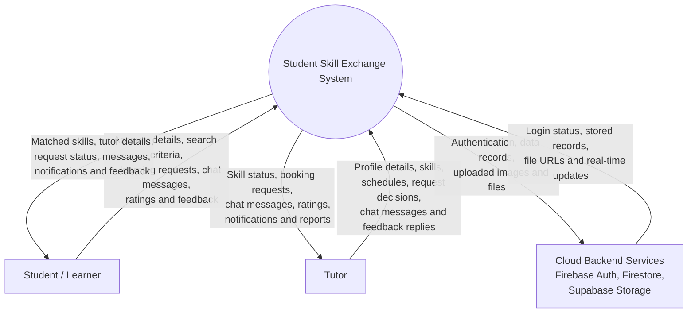

Note: In this context diagram, Firebase Authentication, Cloud Firestore, and Supabase Storage are grouped as Cloud Backend Services to keep the diagram readable. Their individual roles are expanded in the DFD and system architecture diagrams.

---

# 2. DFD Level 0

**Figure 3.2: DFD Level 0 of Student Skill Exchange System**

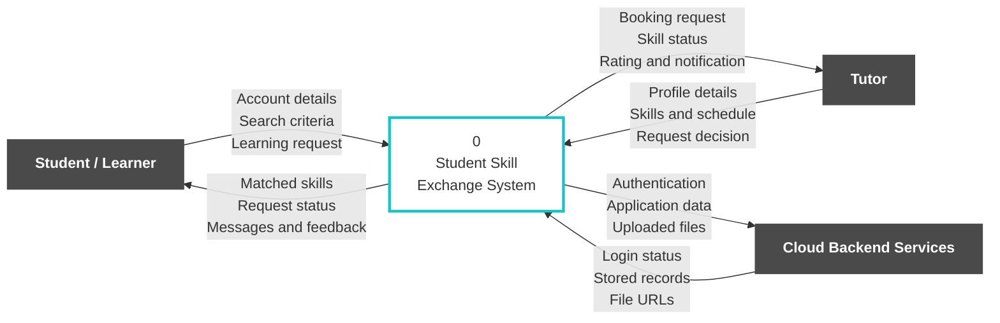

---

# 3. DFD Level 1

**Figure 3.3: DFD Level 1 of Student Skill Exchange System**

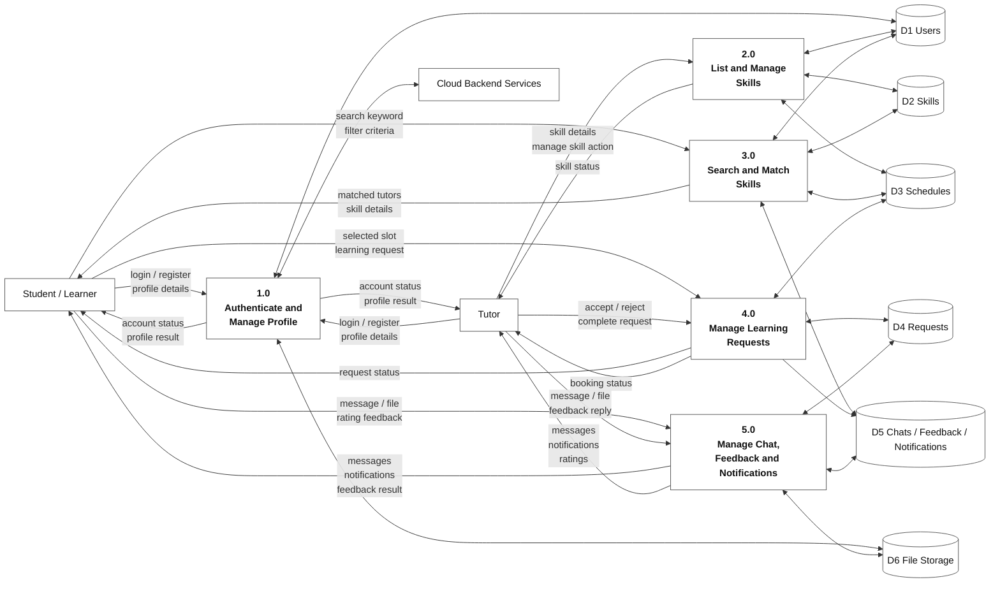

---

# 4. System Flowchart

**Figure 3.4: Flowchart of Student Skill Exchange System**

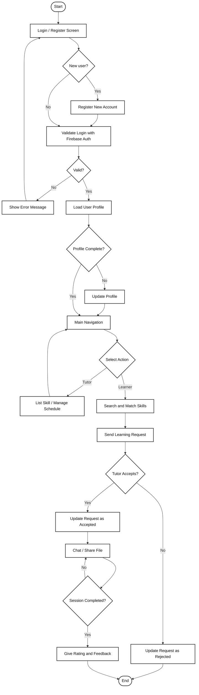

---

# 5. Sequence Diagrams

The sequence diagram is divided into smaller interaction flows.

## 5.1 Authentication Sequence Diagram

**Figure 4.1: Authentication Sequence Diagram**

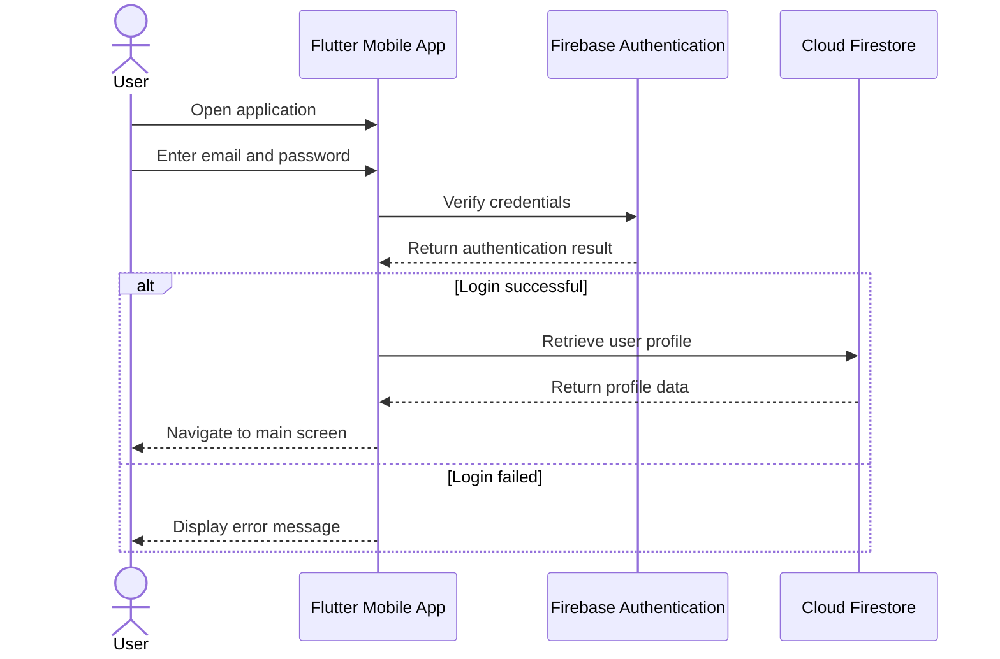

## 5.2 Skill Search and Request Sequence Diagram

**Figure 4.2: Skill Search and Request Sequence Diagram**

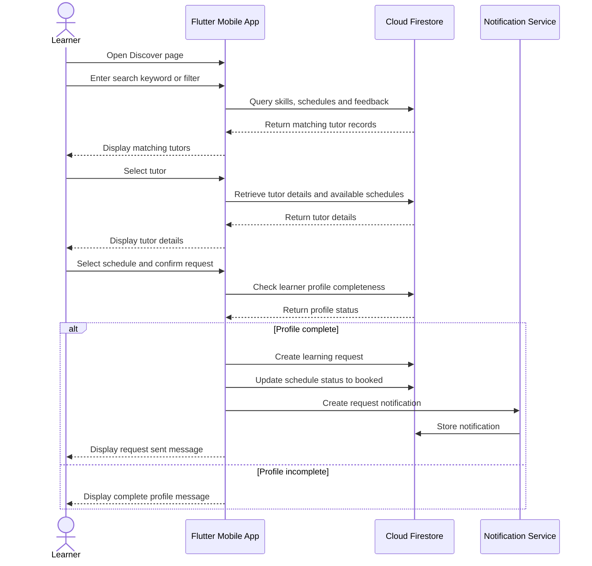

## 5.3 Request Approval Sequence Diagram

**Figure 4.3: Request Approval Sequence Diagram**

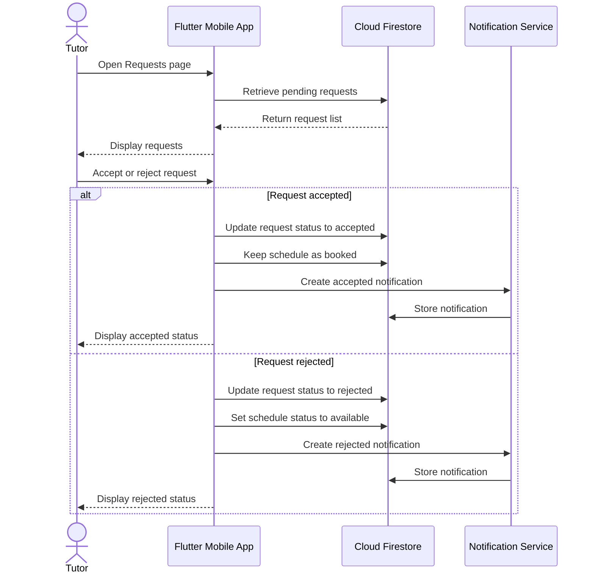

## 5.4 Chat and File Sharing Sequence Diagram

**Figure 4.4: Chat and File Sharing Sequence Diagram**

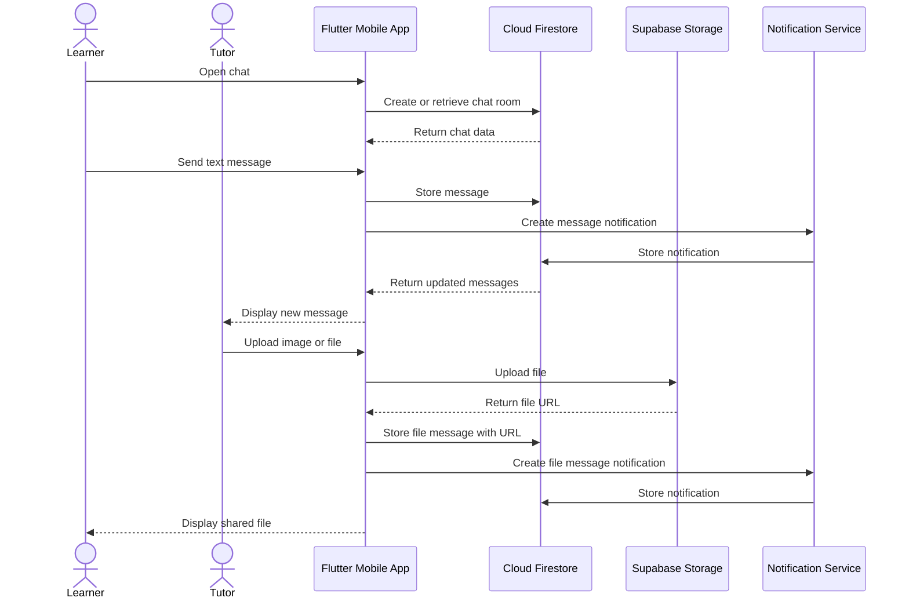

## 5.5 Feedback Sequence Diagram

**Figure 4.5: Feedback Sequence Diagram**

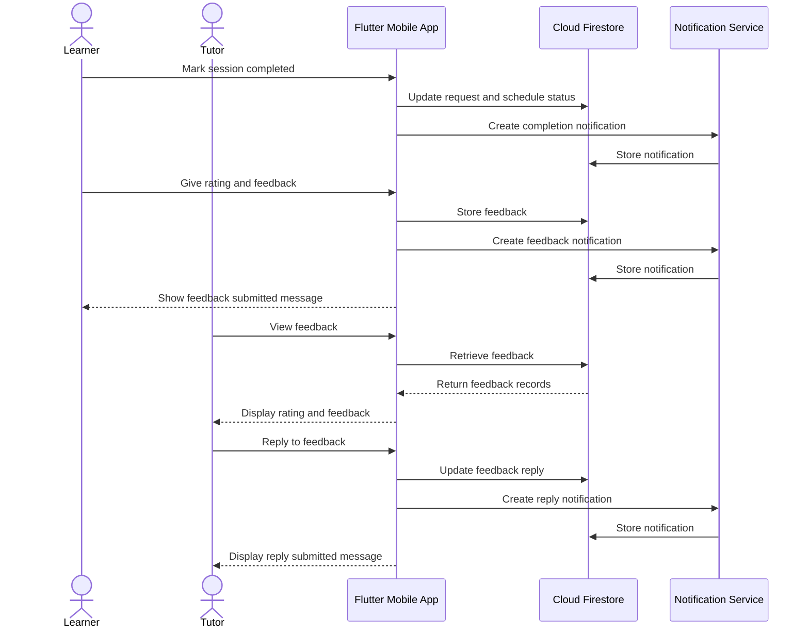

---

# 6. System Architecture Diagram

**Figure 4.1: System Architecture of Student Skill Exchange**

The architecture is organized into five practical layers: Users, Presentation Layer, Application Logic Layer, Service Layer, and Data Layer. The Flutter mobile app handles the user interface and feature workflows, Firebase Authentication manages identity, Cloud Firestore stores real-time application records, and Supabase Storage stores uploaded profile pictures and chat files.

---

# 7. Entity Relationship Diagram

**Figure 4.6: Entity Relationship Diagram of Student Skill Exchange System**

The formatted ERD above follows the database-table style used in system documentation: each entity is shown with primary keys, foreign keys, and main attributes, while relationship lines describe how users, skills, schedules, requests, chats, messages, ratings, notifications, and storage files connect.

Editable Mermaid source:

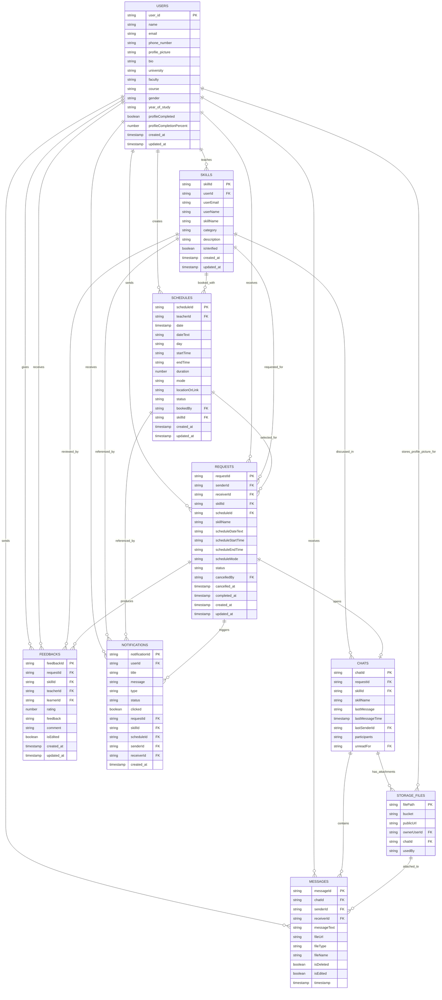

Note: This is a logical ERD for the implemented Firestore and Supabase data model. Firestore is document-based, so several display fields such as user names, skill names, and schedule details are duplicated inside related documents to reduce repeated reads in the Flutter app.

---

# 8. Class Diagram

**Figure 4.7: Class Diagram of Student Skill Exchange System**

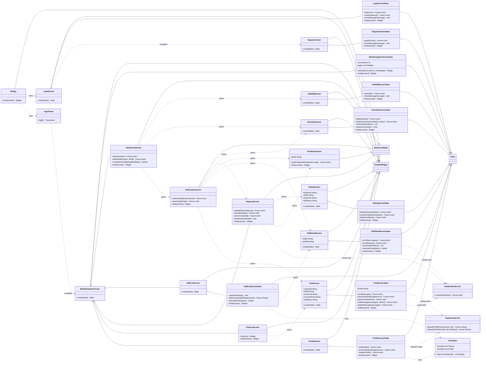

Note: The project does not define separate model classes for Firestore documents. Therefore, this class diagram focuses on the implemented Flutter screen classes, state classes, services, utilities, inheritance, navigation flow, and service dependencies.
